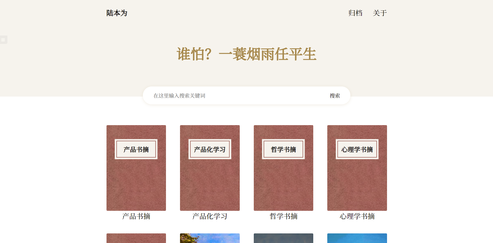
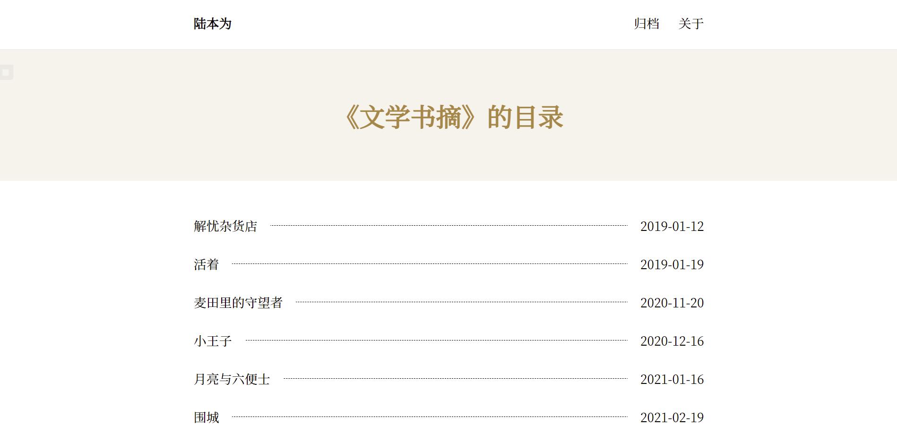
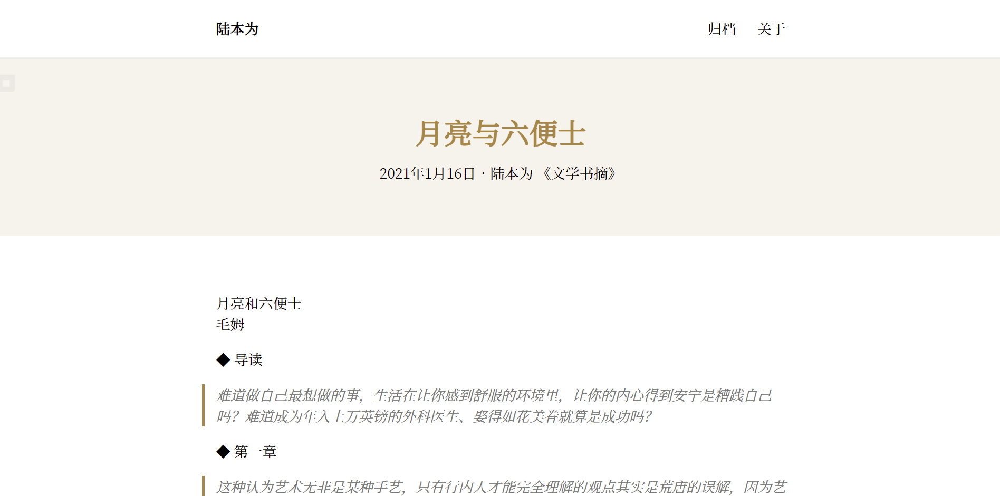
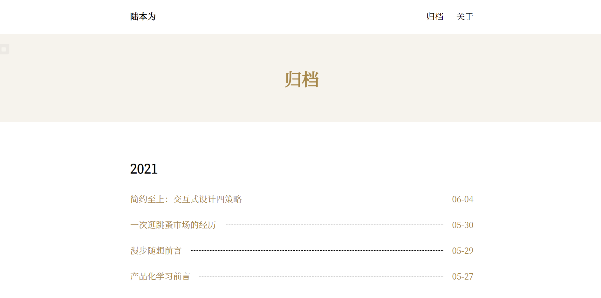

# 修改声明

**注意：本主题由 [nexmoe/hexo-theme-yet-the-books](https://github.com/nexmoe/hexo-theme-yet-the-books) 主题修改而来，详情请阅读原README。**

 由于主题中一些部分不能满足博客要求，故对主题做出了一些修改，而为了成功在线部署必须提交NPM包，如果侵犯了作者的知识产权请立刻联系我我会将其删除。

修改部分有下：

- 修改了NavBar逻辑，不再显示英文默认菜单项。
- 修复了试图读取Page Tags（只有Post才有Tags）的Bug
- 在Post的Front-matter中增加了Editor项，默认显示主编
- 修改底部的文章导航顺序为标题顺序
- 去掉了评论功能


# 效果预览

预览网址：[南南地理 (dledu.top)](http://dledu.top/)

|  |  |
| :----------------------------: | :------------------------------: |
|          首页（书架）          |          分类页（目录）          |
|        |          |
|             文章页             |              归档页              |


# 主题逻辑

| 对应博客逻辑 | 对应书的关系 |
| ------------ | ------------ |
| 首页         | 书架         |
| 一个分类     | 一本书       |
| 分类详情页   | 目录         |
| 一篇文章     | 目录中的一条 |


# 使用

使用下面的命令进行安装（安装完就可以直接用了

```shell
npm i hexo-theme-yet-the-books-custom
```

配置主题请更改根目录文件 _config.yet-the-books-custom.yml

注意：使用本主题，你的文章必须得有一个分类


# 使用示例

https://github.com/nexmoe/books


# Front-matter

| 参数       | 描述                                                       | 默认值         |
| :--------- | :--------------------------------------------------------- | :------------- |
| `cover`    | 封面，需为图片目录或链接                                   | null           |
| `order_by` | 目录根据文章的什么排序（可选值：date,-date,title,url,...） | theme.order_by |
| `color`    | 封面颜色（可选值：red,purple,gray,blue,green）             | red            |
| `editor`   | （可选）该页编辑者                                         | 主编           |

其他：https://hexo.io/zh-cn/docs/front-matter

https://jq.qq.com/?_wv=1027&k=4sLtwk78)
